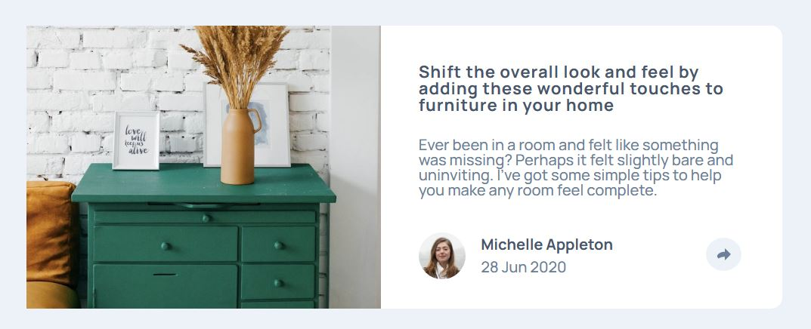

# Frontend Mentor - Article preview component

This is a solution to the [Article preview component challenge on Frontend Mentor](https://www.frontendmentor.io/challenges/article-preview-component-dYBN_pYFT). Frontend Mentor challenges help you improve your coding skills by building realistic projects. 

## Table of contents

- [Overview](#overview)
  - [The challenge](#the-challenge)
  - [Screenshot](#screenshot)
  - [Links](#links)
  - [Built with](#built-with)
  - [Useful resources](#useful-resources)
- [Author](#author)

## Overview

### The challenge

Users should be able to:

- View the optimal layout for the component depending on their device's screen size
- See the social media share links when they click the share icon

### Screenshot

### Links

- Solution URL: [Source code](https://github.com/kuushal/frontend-mentor/tree/main/article-preview-component/)
- Live Site URL: [Live URL](https://kuushal.github.io/frontend-mentor/article-preview-component/)

### Built with

- Flexbox
- Javascript
- CSS Grid
- Semantic HTML5 markup
- CSS custom properties
- Mobile-first workflow

### Useful resources

- [How to give background color to padding of an element](https://stackoverflow.com/questions/14628601/can-i-add-background-color-only-for-padding)
- [How to create a downwards facing arrow using html and css](https://dev.to/flippedcoding/how-to-put-arrows-at-the-bottom-of-a-div-4hnn)

## Author

- Github - [kuushal](https://www.github.com/kuushal)