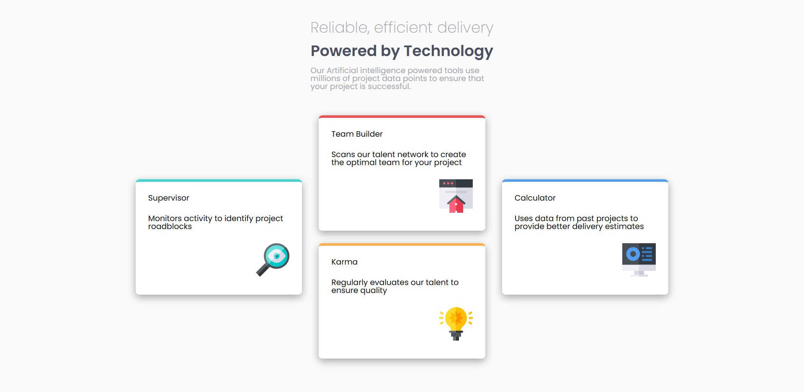

# Frontend Mentor - Four card feature section

This is a solution to the [Four card feature section challenge on Frontend Mentor](https://www.frontendmentor.io/challenges/single-price-grid-component-5ce41129d0ff452fec5abbbc). Frontend Mentor challenges help you improve your coding skills by building realistic projects. 

## Table of contents

- [Overview](#overview)
  - [The challenge](#the-challenge)
  - [Screenshot](#screenshot)
  - [Links](#links)
  - [Built with](#built-with)
  - [Useful resources](#useful-resources)
- [Author](#author)

## Overview

### The challenge

Users should be able to:

- View the optimal layout for the section depending on their device's screen size

### Screenshot

### Links

- Solution URL: [Source code](https://github.com/kuushal/frontend-mentor/tree/main/four-card-feature-section/)
- Live Site URL: [Live URL](https://kuushal.github.io/frontend-mentor/four-card-feature-section/)

### Built with

- CSS Grid
- Semantic HTML5 markup
- CSS custom properties
- Mobile-first workflow

### Useful resources

## Author

- Github - [kuushal](https://www.github.com/kuushal)