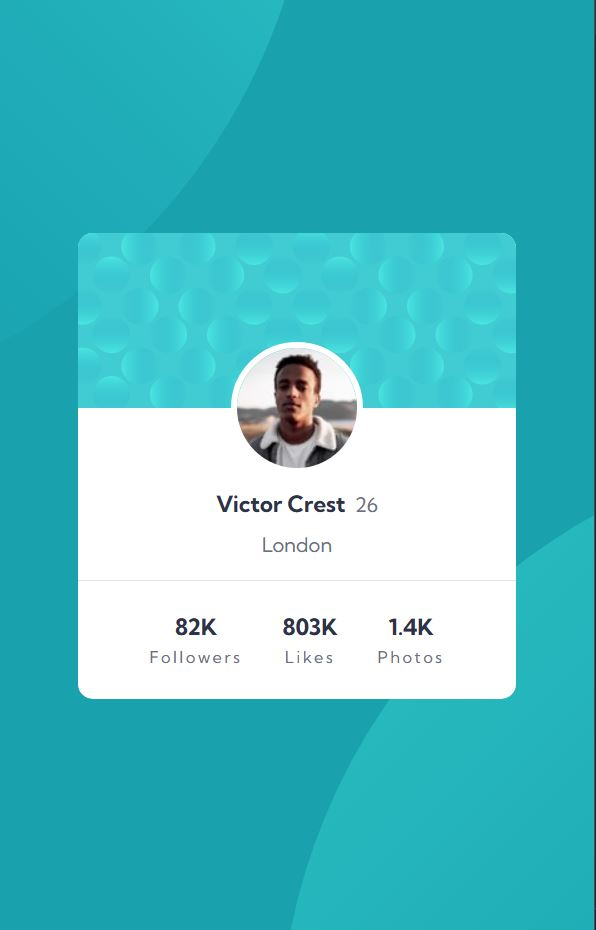

# Frontend Mentor - Profile card component solution

This is a solution to the [Profile card component challenge on Frontend Mentor](https://www.frontendmentor.io/challenges/profile-card-component-cfArpWshJ). Frontend Mentor challenges help you improve your coding skills by building realistic projects. 
## Table of contents

- [Overview](#overview)
  - [The challenge](#the-challenge)
  - [Screenshot](#screenshot)
  - [Links](#links)
  - [Built with](#built-with)
  - [Useful resources](#useful-resources)
- [Author](#author)

## Overview

### The challenge

Users should be able to:

    - Build out the project to the designs provided

### Screenshot

### Links

- Solution URL: [Source code](https://github.com/kuushal/frontend-mentor/tree/main/profile-card-component)
- Live Site URL: [Live URL](https://kuushal.github.io/frontend-mentor/profile-card-component/)

### Built with

- Semantic HTML5 markup
- CSS custom properties
- Flexbox
- Mobile-first workflow

### Useful resources

- Multiple Backgrounds:[w3school](https://www.w3schools.com/Css/css3_backgrounds.asp)

## Author

- Github - [kuushal](https://www.github.com/kuushal)