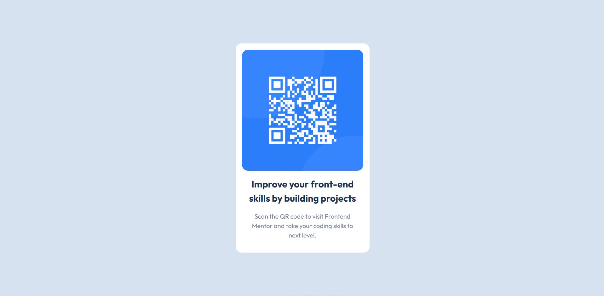

# Frontend Mentor - QR code component solution

This is a solution to the [QR code component challenge on Frontend Mentor](https://www.frontendmentor.io/challenges/qr-code-component-iux_sIO_H). Frontend Mentor challenges help you improve your coding skills by building realistic projects. 

## Table of contents

- [Overview](#overview)
  - [Screenshot](#screenshot)
  - [Links](#links)
  - [Useful resources](#useful-resources)
- [Author](#author)

## Overview

### Screenshot

### Links

- Solution URL: [Source Code](https://github.com/kuushal/frontend-mentor/tree/main/qr-code-components)
- Live Site URL: [Live URL](https://kuushal.github.io/frontend-mentor/qr-code-components)

### Built with

- Semantic HTML5 markup
- CSS custom properties
- Flexbox
- Mobile-first workflow

### Useful resources

- [CSS Reset joshwcomeau](https://www.joshwcomeau.com/css/custom-css-reset/) - This helped me for resetting the css. I really liked this pattern and will use it going forward.

## Author

- Github - [Kushal](https://www.github.com/kuushal)

